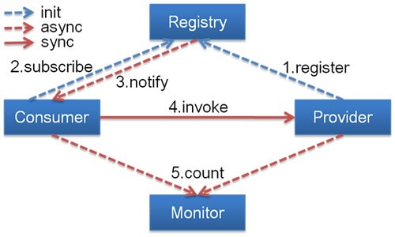

# Dubbo说明 #

## Dubbo介绍 ##

> Dubbo是阿里巴巴公司开源的一个高性能优秀的RPC服务框架，使得应用可通过高性能的RPC实现服务的输出和输入功能，可以和Spring框架无缝集成。

## Dubbo核心 ##

> 1.Remoting: 网络通信框架，实现了 sync-over-async 和 request-response 消息机制.   
> 2.RPC: 一个远程过程调用的抽象，支持负载均衡、容灾和集群功能   
> 3.Registry: 服务目录框架用于服务的注册和服务事件发布和订阅

### Dubbo原理 ###

> 其中Provider是服务的提供者，Consumer是服务的消费者，Register是注册中心，Monitor是统计服务调用和时间日志的服监控中心。

## Dubbo的使用范围和适用场景 ##

> 1.透明化的远程方法调用，就像调用本地方法一样调用远程方法，只需简单配置，没有任何API侵入。   
> 2.软负载均衡及容错机制，可在内网替代F5等硬件负载均衡器，降低成本，减少单点。   
> 3.服务自动注册与发现，不再需要写死服务提供方地址，注册中心基于接口名查询服务提供者的IP地址，并且能够平滑添加或删除服务提供者。   

## Dubbo注册 ## 

> Dubbo注册分为广播注册和zookeepe服务注册两种方式。