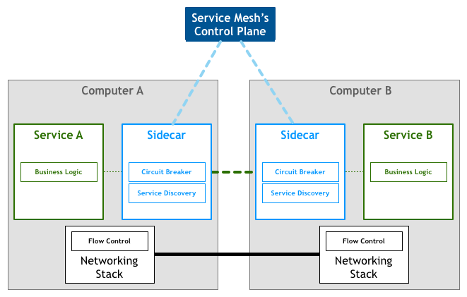
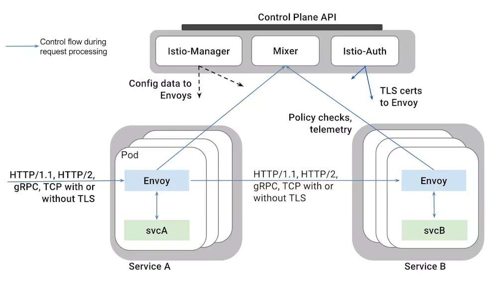
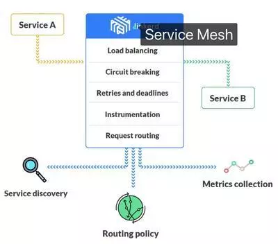

# 认识ServiceMesh #

## 1.ServiceMesh简介 ##

> Service Mesh 是一个基础设施层，用于处理服务间通信。云原生应用有着复杂的服务拓扑，Service Mesh 保证请求可以在这些拓扑中可靠地穿梭。
在实际应用当中，Service Mesh 通常是由一系列轻量级的网络代理组成的，它们与应用程序部署在一起，但应用程序不需要知道它们的存在。

## 2.ServiceMesh的特点 ##

>Service Mesh 实际上就是处于 TCP/IP 之上的一个抽象层，它假设底层的 L3/L4 网络能够点对点地传输字节（当然，它也假设网络环境是不可靠的，所以 Service Mesh 必须具备处理网络故障的能力）。

. 1应用程序间通讯的中间层；
. 2轻量级网络代理；
. 3应用程序无感知；
. 4解耦应用程序的重试、超时、监控、追踪和服务发现；

## 3.ServiceMesh原理 ##

> 如果用一句话来解释什么是 Service Mesh，可以将它比作是应用程序或者说微服务间的 TCP/IP，负责服务之间的网络调用、限流、熔断和监控。对于编写应用程序来说一般无须关心 TCP/IP 这一层（比如通过 HTTP 协议的 RESTful 应用），同样使用 Service Mesh 也就无须关系服务之间的那些原来是通过应用程序或者其他框架实现的事情，比如 Spring Cloud、OSS，现在只要交给 Service Mesh 就可以了。

>Phil Calçado 在他的这篇博客 Pattern: Service Mesh 中详细解释了 Service Mesh 的来龙去脉：
1从最原始的主机之间直接使用网线相连
2网络层的出现
3集成到应用程序内部的控制流
4分解到应用程序外部的控制流
5应用程序的中集成服务发现和断路器
6出现了专门用于服务发现和断路器的软件包/库，Twitter’s Finagle和 Facebook’s Proxygen。这时候还是集成在应用程序内部
7出现了专门用于服务发现和断路器的开源软件，如：NetflixOSS ecosystem
8最后作为微服务的中间层Service Mesh出现

其架构如图：

## 4.方案 ##

> 目前社区Service Mesh的开源解决方案有：Buoyant 公司推出的 Linkerd 和 Google、IBM 等厂商牵头的 Istio。Linkerd 更加成熟稳定些，Istio 功能更加丰富、设计上更为强大，社区相对也更加强大一些。所以普遍认为 Istio 的前景会更好，但是毕竟还处于项目的早期，问题还很多。

### 4.1 Istio方案 ###

>Istio是由Google、IBM和Lyft开源的微服务管理、保护和监控框架。Istio为希腊语，意思是”起航“。官方中文文档地址：https://istio.doczh.cn

Istio的架构:
 
 

 >Istio架构分为控制层和数据层。
1数据层：由一组智能代理（Envoy）作为sidecar部署，协调和控制所有microservices之间的网络通信。
2控制层：负责管理和配置代理路由流量，以及在运行时执行的政策。
Istio架构各个组成部分。
1Envoy：Istio使用Envoy代理的扩展版本，该代理是以C++开发的高性能代理，用于调解service mesh中所有服务的所有入站和出站流量。
2Mixer：Mixer负责在service mesh上执行访问控制和使用策略，并收集Envoy代理和其他服务的遥测数据。
3Istio Manager：Istio-Manager用作用户和Istio之间的接口，收集和验证配置，并将其传播到各种Istio组件。
4Istio-auth：Istio-Auth提供强大的服务间和最终用户认证，使用相互TLS，内置身份和凭据管理。

### 4.2 Linkerd方案 ###

>Linkerd 是开源网络代理，设计为以服务网格部署：用于管理，控制和监控应用程序内的服务与服务间通讯的专用层。

Linkerd架构：

>Linkerd 基本功能
1Load balancing：负载均衡算法，它们使用实时性能指标来分配负载并减少整个应用程序的尾部延迟。
2Circuit breaking：自动熔断，将停止将流量发送到被认为不健康的实例，从而使他们有机会恢复并避免连锁反应故障。
3Service discovery：服务发现后端集成，通过删除特定的(ad-hoc)服务发现实现来帮助您降低代码的复杂性。
4Dynamic request routing：动态请求路由和重新路由，允许您使用最少量的配置来设置分段服务(staging service)，金丝雀(canaries)，蓝绿部署(blue-green deploy)，跨DC故障切换和黑暗流量(dark traffic)。
5Retries and deadlines：在某些故障时自动重试请求，并且可以在指定的时间段之后让请求超时。
6TLS：可以配置为使用 TLS 发送和接收请求，您可以使用它来加密跨主机边界的通信，而不用修改现有的应用程序代码。
7HTTP proxy integration：可以作为 HTTP 代理，几乎所有现代 HTTP 客户端都广泛支持，使其易于集成到现有应用程序中。
8Transparent Proxying：在主机上使用 iptables 规则，设置通过 linkerd 的透明代理
9gRPC： 支持 HTTP/2 和 TLS，允许它路由 gRPC 请求，支持高级 RPC 机制，如双向流，流程控制和结构化数据负载。
10Distributed tracing：分布式跟踪和度量仪器，可以提供跨越所有服务的统一的可观察性。
11Instrumentation：支持分布式跟踪和度量仪器，可以提供跨越所有服务的统一的可观察性。